# Helm

Personal live task board, readable by you and by AI agents.

Helm is one calm board for everything you're doing: open on a second monitor, installed on your
phone, and readable and writable by AI assistants through a REST API and MCP, with your
permission. Changes show up everywhere at once.

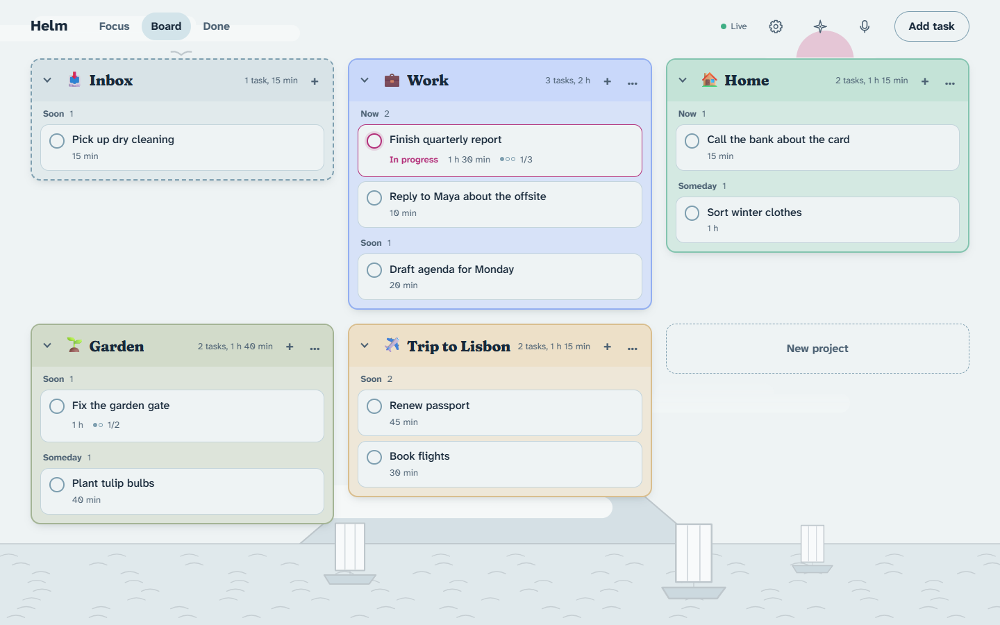

<sub>Screenshots show a demo board with sample tasks.</sub>

## How it works

### Tasks

A task has a title, notes, a project, a priority and an estimate, and can have one level of
subtasks. Priority is one of three words rather than a number: **Now** (today), **Soon** (the
next few days) or **Someday** (no rush). Tasks without a project go to the Inbox.

Only one task is in progress at a time (`HELM_IN_PROGRESS_LIMIT`); starting another pauses the
one before. Every task records where it came from: typed in, spoken, or added by an AI
assistant (`ai:<name>`).

### Focus

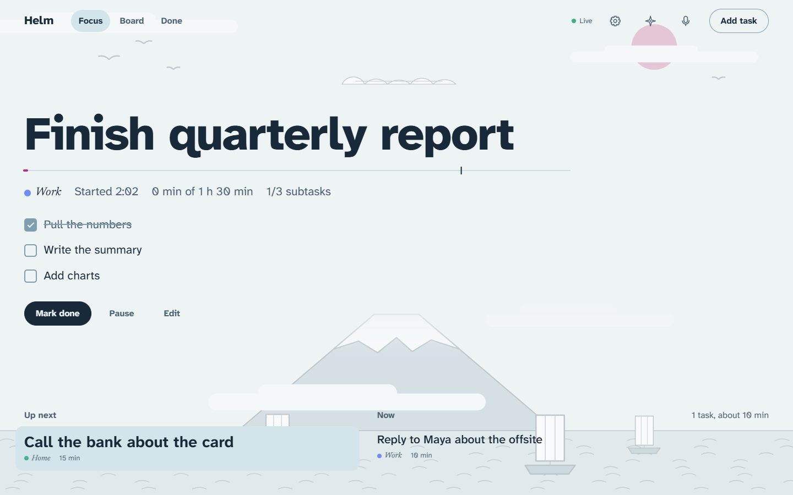

The view to leave open. The task in progress sits at the top in large type, with its subtasks
and a timeline of time spent against the estimate (it turns to the accent color when you run
over). Below it: what's up next, then the rest of Now and Soon, each with a Start button.

### Board, Done and your phone

<p>
  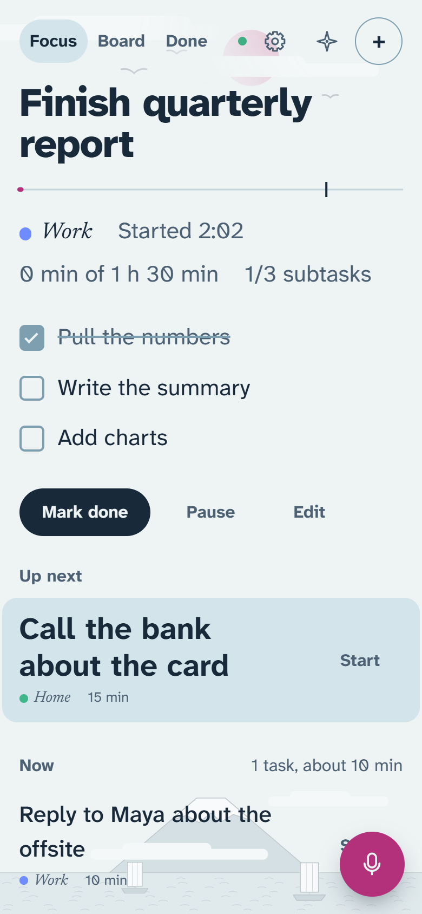
  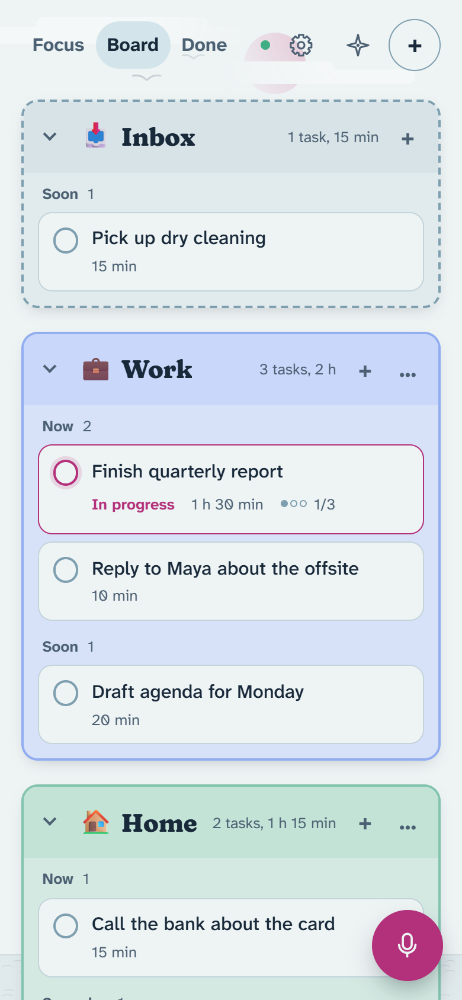
  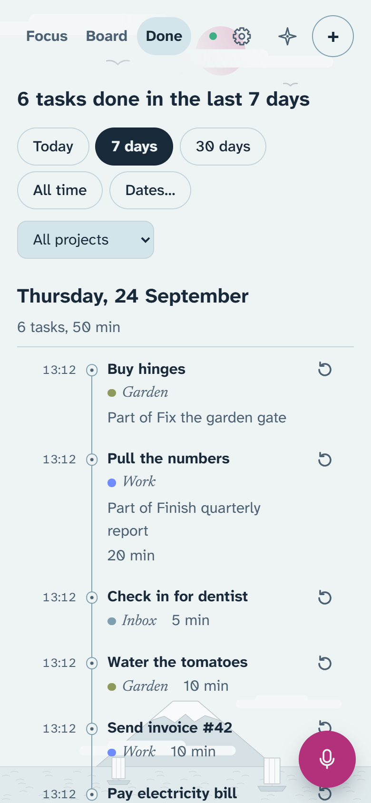
</p>

- **Board**: one panel per project, with an emoji picked from its name (or one you choose) and
  tasks grouped by priority inside it. Drag a task to another panel or priority, reorder within
  one, and double-click a panel to fold it. Settings → Board panels sets how strongly the panels
  stand out from the page.
- **Done**: what you finished, grouped by day with a time for each, filtered by date range or
  project. Reopen anything finished by mistake.
- **On a phone** Helm installs from the browser like an app and opens offline with the last
  board it saw. The microphone floats at the bottom right, in thumb reach.

Everything is live: a change on one device, or by an AI assistant, appears on the others within
a moment. Keys on a desktop: **N** new task, **V** voice, **A** assistant, **F**/**B**/**D** to
switch views.

### Voice

<p>
  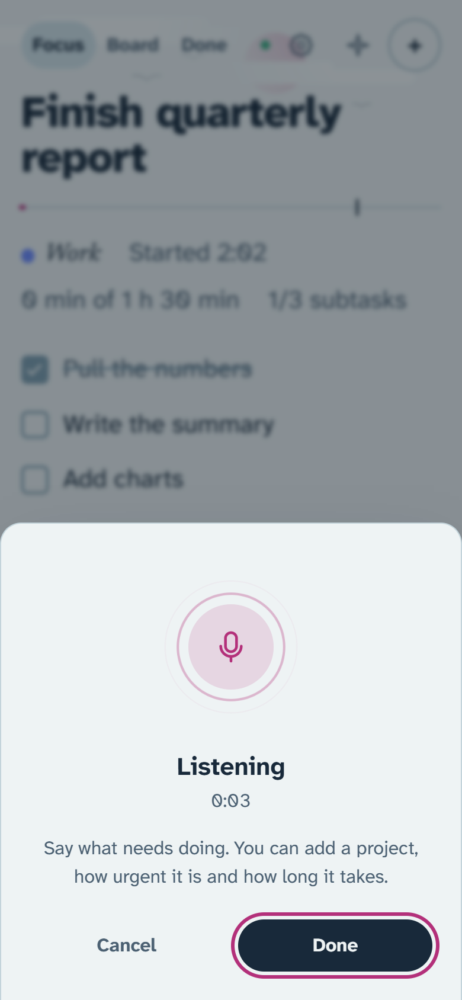
  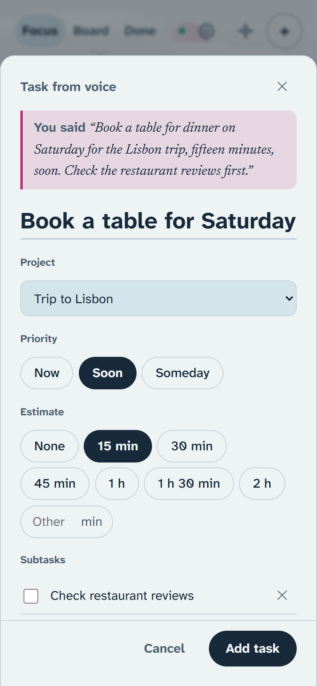
</p>

Say what needs doing, the way you'd tell a person. Helm transcribes it and fills in the title,
project, priority, estimate and subtasks, then opens the task with what you said above it.
Nothing is saved until you press Add task, and several to-dos in one recording become one draft
each. See [Voice input](#voice-input).

### Assistant panel

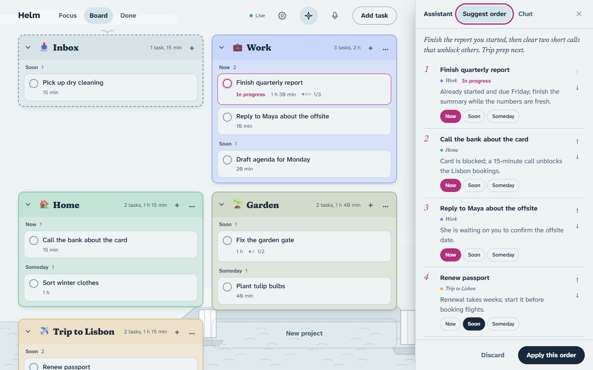

**Suggest order** ranks your open tasks with a one-line reason each. Change any priority or
position, then apply; Undo puts everything back. **Chat** answers questions about the board
and proposes changes (add, edit, start, finish; never delete) that you tick and apply. See
[Assistant](#assistant).

### Themes

<table>
  <tr>
    <td align="center"><br>Harbor</td>
    <td align="center">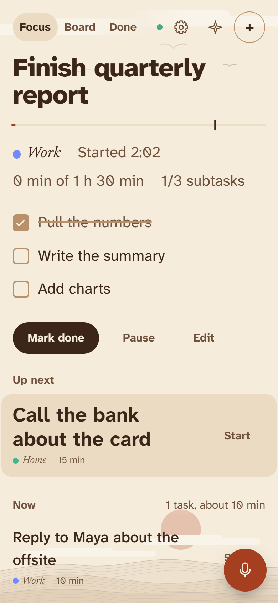<br>Desert</td>
    <td align="center">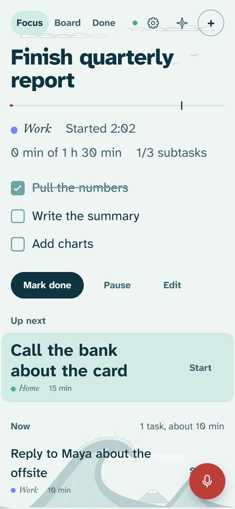<br>Beach</td>
    <td align="center">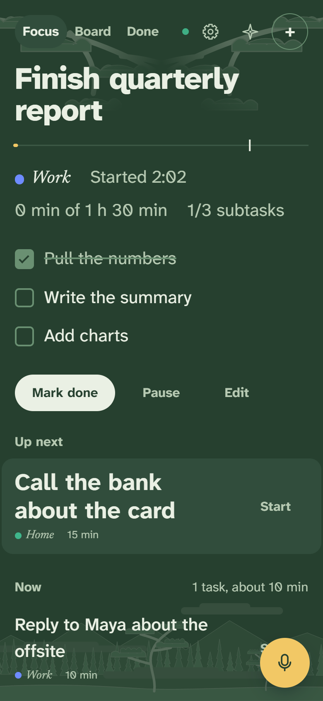<br>Deep forest</td>
  </tr>
  <tr>
    <td align="center">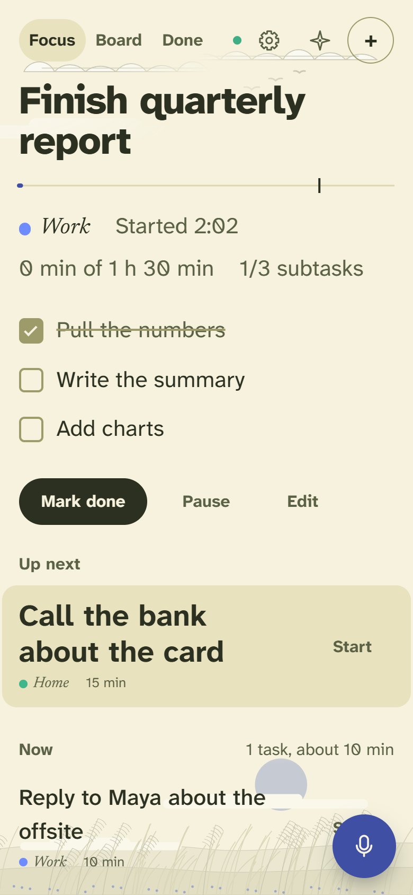<br>Prairie</td>
    <td align="center">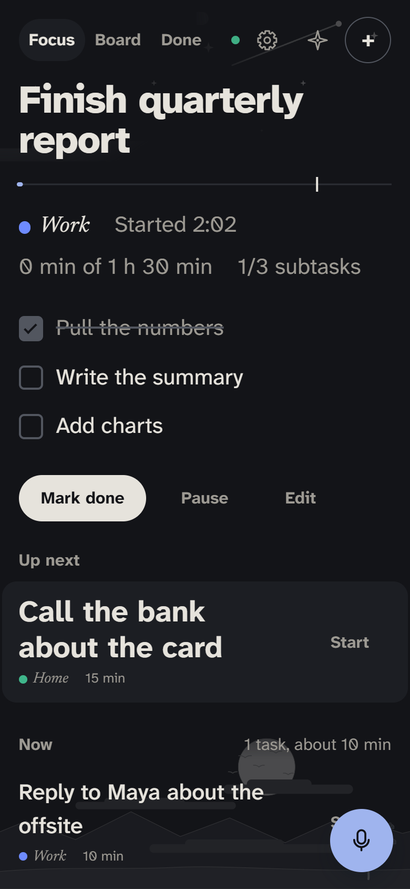<br>Night</td>
    <td align="center">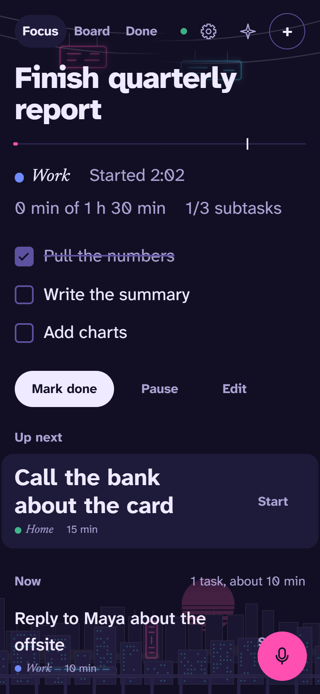<br>Neo Tokyo</td>
    <td></td>
  </tr>
</table>

Harbor (the default, following your device between light and dark), Desert, Beach, Deep
forest, Prairie, Night and Neo Tokyo. Each has a woodblock-print landscape along the bottom of
the screen and a lighter sky along the top (on phones, just its two corners), drawn in the
theme's own colors. You can turn the landscape off. Chosen in Settings, per device.

### AI agents

In Settings, create a token for each assistant or script: read only or read and change, all
projects or only some, with an optional expiry. It then works with the board through MCP at
`/mcp` or the REST API at `/api/v1`, and anything it adds is labelled with its name. See
[Connect AI assistants](#connect-ai-assistants).

## Run locally

```bash
pnpm install
cp .env.example .env        # set HELM_OWNER_PASSWORD and HELM_SESSION_SECRET
pnpm --filter @helm/server seed   # optional sample data
pnpm dev                    # server on :8787, web on :5173
```

Open http://localhost:5173 and sign in with `HELM_OWNER_PASSWORD`.

## Use it as an app

```bash
pnpm build                  # builds the PWA into apps/web/dist
pnpm start                  # server on :8787 serves the API and the app (HELM_WEB_DIST)
```

Open http://localhost:8787 and install it from the browser (the install icon in the address
bar in Chrome or Edge). The installed app:

- opens without a connection, showing the last board it saw (marked Offline); changes need
  the server and say so if they can't be saved
- updates itself when a new build is served, checking hourly while it stays open
- keeps the board, projects and sign-in state in the browser's local storage on that device,
  cleared when the session ends

Installing needs a secure origin: `localhost` works; for a phone, serve it over HTTPS
(see [Phone and other devices](#phone-and-other-devices)).

## Run with Docker

One container runs everything: API, live sync, MCP and the app. Data lives in the `helm-data`
volume, so rebuilding or updating the image keeps it.

```bash
cp .env.example .env        # if you haven't: password, session secret, OpenAI key
docker compose up -d --build
```

Open http://localhost:8787. Compose publishes the port on `127.0.0.1` only, so nothing else on
your network can connect directly.

- Update: `git pull`, then `docker compose up -d --build`.
- Logs: `docker compose logs -f helm`.
- Logs are rotated (at most about 15 MB).

### Backups

Helm saves a copy of the database every day (`helm-YYYY-MM-DD.db`) and keeps the newest 14
(`HELM_BACKUP_KEEP`). In Docker they're in the volume, under `/data/backups`. Copies taken
while Helm runs are consistent, even mid-write.

- Copy them out of the container, then keep them somewhere other than this machine:

  ```bash
  docker compose cp helm:/data/backups ./helm-backups
  ```

- Restore one (this replaces what's in the volume):

  ```bash
  docker compose stop helm
  docker compose run --rm helm node -e "require('better-sqlite3')('/data/backups/helm-2026-09-24.db').backup('/data/helm.db').then(() => console.log('restored'))"
  docker compose start helm
  ```

- Bring over a database from somewhere else, such as `pnpm start` on this machine (stop that
  server first) or a backup file: put it in a folder as `helm.db`, then

  ```bash
  docker compose stop helm
  docker compose run --rm -v ./apps/server/data:/import helm node -e "require('better-sqlite3')('/import/helm.db').backup('/data/helm.db').then(() => console.log('imported'))"
  docker compose start helm
  ```

  Use your folder in place of `./apps/server/data`. This also replaces what's in the volume.

## Phone and other devices

Use [Tailscale](https://tailscale.com): it gives Helm an HTTPS address that only your own
devices can open. HTTPS is what the phone needs to install the app and use the microphone.

1. Install Tailscale on the computer running Helm and on your phone, signed in to the same
   account.
2. In the Tailscale admin console, under DNS, turn on MagicDNS and HTTPS certificates.
3. On the computer: `tailscale serve --bg 8787`. It prints the address, like
   `https://your-pc.your-tailnet.ts.net`.
4. Set `HELM_COOKIE_SECURE=true` in `.env` and restart Helm (`docker compose up -d`, or restart
   `pnpm start`).
5. On the phone, open that address, sign in, and add it to the home screen (Share → Add to
   Home Screen on iPhone; the install prompt or ⋮ → Install app on Android).

AI assistants on other devices use the same address, for example
`https://your-pc.your-tailnet.ts.net/mcp`; Settings shows the right commands when opened there.

Use `tailscale serve`, not `tailscale funnel`: funnel puts Helm on the public internet. To stop
serving: `tailscale serve reset`.

## Raspberry Pi

A Pi makes a good always-on home for Helm: it uses little power and stays on when your laptop
sleeps. A Pi 4 or 5 with 2 GB or more works; the steps assume Raspberry Pi OS Lite (64-bit).

1. **Set up the Pi.** In Raspberry Pi Imager, choose Raspberry Pi OS Lite (64-bit). In its
   settings, set the hostname (say `helm`), your user and password, and turn on SSH. Start the
   Pi, then from your computer: `ssh you@helm.local`.

2. **Install Docker and Tailscale** on the Pi:

   ```bash
   curl -fsSL https://get.docker.com | sh
   sudo usermod -aG docker $USER      # then log out and back in
   curl -fsSL https://tailscale.com/install.sh | sh
   sudo tailscale up                  # open the link it prints and sign in
   ```

3. **Get Helm.** The repository is private, so sign in to GitHub first (`sudo apt install gh`,
   then `gh auth login`):

   ```bash
   gh repo clone Motyst/helm && cd helm
   ```

4. **Settings.** From your computer, copy your `.env` over (it holds the password and the OpenAI
   key, so don't commit it or post it anywhere):

   ```bash
   scp .env you@helm.local:~/helm/.env
   ```

   On the Pi, set `HELM_COOKIE_SECURE=true` in `~/helm/.env` (Helm is reached over HTTPS there).

5. **Start it:** `docker compose up -d --build`. The first build takes a few minutes; after
   that Helm starts with the Pi, and restarts if it stops.

6. **Bring your tasks.** Stop Helm on your computer first, so its database is complete. Then copy
   the database over and import it (see [Backups](#backups)):

   ```bash
   # on your computer (with Docker, first: docker compose cp helm:/data/backups/<newest> ./helm.db)
   ssh you@helm.local mkdir -p helm/import
   scp apps/server/data/helm.db you@helm.local:~/helm/import/helm.db
   # on the Pi, in ~/helm
   docker compose stop helm
   docker compose run --rm -v ./import:/import helm node -e "require('better-sqlite3')('/import/helm.db').backup('/data/helm.db').then(() => console.log('imported'))"
   docker compose start helm
   rm -r import
   ```

7. **Open it on your devices.** On the Pi: `sudo tailscale serve --bg 8787`. It prints the
   address, like `https://helm.your-tailnet.ts.net`, and keeps serving after restarts. Then
   follow [Phone and other devices](#phone-and-other-devices) from step 5. AI assistants keep
   their tokens (they're in the database); point them at the new `/mcp` address.

Update: `cd ~/helm && git pull && docker compose up -d --build && docker image prune -f`.

Keep copies of the backups off the Pi, since SD cards do fail. From your computer, for example:

```bash
ssh you@helm.local "cd helm && docker compose cp helm:/data/backups ./helm-backups"
scp -r you@helm.local:~/helm/helm-backups ./helm-backups
```

A USB SSD lasts longer than an SD card, but Helm writes little, so an SD card is fine to start.

## Voice input

Press the microphone (or V), say the task, press Done. Helm transcribes it, fills in the
title, project, priority, estimate and subtasks, and opens the task for you to check. Nothing is
saved until you press Add task. Several separate to-dos in one recording become one draft each.

- With `OPENAI_API_KEY` set, audio goes to OpenAI for transcription (`HELM_STT_MODEL`) and the
  text to `HELM_LLM_MODEL` for the fields.
- Without a key, the browser's own speech recognition is used where it exists (Chrome sends the
  audio to Google; Safari works on the device), and what you said becomes the title as is.
- The microphone only works on a secure origin: `localhost`, or HTTPS on a phone.

Providers sit behind small interfaces in `packages/providers` (`LlmProvider`, `SttProvider`).
Choose them with `HELM_LLM_PROVIDER` and `HELM_STT_PROVIDER` (`openai` or `none`);
`OPENAI_BASE_URL` points the OpenAI adapter at any compatible API.

`POST /api/v1/voice/parse` takes audio (`Content-Type: audio/webm`, `audio/mp4`, ...) or JSON
`{"text": "..."}` and returns suggestions without saving them. Read-only tokens can't use it.

## Assistant

Open the assistant with the compass button (or A). It needs `OPENAI_API_KEY` (or another
`HELM_LLM_PROVIDER`). Your open tasks and the last week's done work are sent to the model with
each request.

- **Suggest order**: a working order for all open tasks, a suggested priority and a one-line
  reason for each. Change priorities or move rows, then apply. Undo puts everything back.
- **Chat**: ask about the board or ask for changes. The assistant only proposes changes (add,
  edit, start, pause, finish, reopen; never delete); tick the ones you want and apply them.

Applied changes are recorded as `ai:assistant`. Endpoints (owner only): `POST
/api/v1/assistant/prioritize`, `POST /api/v1/assistant/chat` (streams NDJSON) and `POST
/api/v1/assistant/apply`. `POST /api/v1/tasks/arrange` reorders tasks for any client.

## Connect AI assistants

In Helm, open Settings (the cog) and create a token for each assistant or script. Choose read
only or read and change, all projects or only some, and an optional expiry. The token is shown
once; Helm keeps only its SHA-256. Revoking takes effect immediately, including open streams.

**MCP** (Streamable HTTP) at `/mcp`, bearer token only:

```bash
claude mcp add --transport http helm http://localhost:8787/mcp --header "Authorization: Bearer helm_..."
```

Tools: `get_focus`, `list_tasks`, `get_task`, `list_projects`, `list_done`, and with read and
change access `create_task`, `update_task`, `start_task`, `pause_task`, `complete_task`,
`reopen_task`, `move_task`. Read-only tokens only see the read tools. There is no delete tool.

**REST**: every `/api/v1` endpoint accepts `Authorization: Bearer helm_...`, with the same
scope rules. Tasks created with a token are marked `ai:<token name>`.

Assistants that only accept OAuth connectors (such as Claude or ChatGPT on the web) can't use a
plain token yet.

## Layout

```
apps/server         Hono API, SSE stream, services (all rules live here), modules
apps/web            React PWA
packages/shared     zod schemas, types, pure logic (tree, focus)
packages/db         Drizzle schema + SQLite migrations
packages/providers  LLM and speech-to-text adapters (OpenAI)
```

Every write goes through `apps/server/src/core/services`. REST, MCP and AI modules call the
same services with a `Principal`, so scope checks and events happen in one place.

## Scripts

- `pnpm build`: the app (`apps/web/dist`) and the server bundle (`apps/server/dist/server.mjs`)
- `pnpm test`: all tests
- `pnpm typecheck`: all packages
- `pnpm db:generate`: new migration after editing `packages/db/src/schema.ts`
- `pnpm --filter @helm/web icons`: regenerate app icons after editing `apps/web/scripts/icons.mjs`

## Config

See `.env.example`. Task rules are config, not code:
`HELM_IN_PROGRESS_LIMIT` (default 1, 0 = unlimited) and `HELM_MAX_SUBTASK_DEPTH` (default 1).

## License

[MIT](LICENSE)
