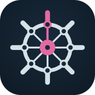
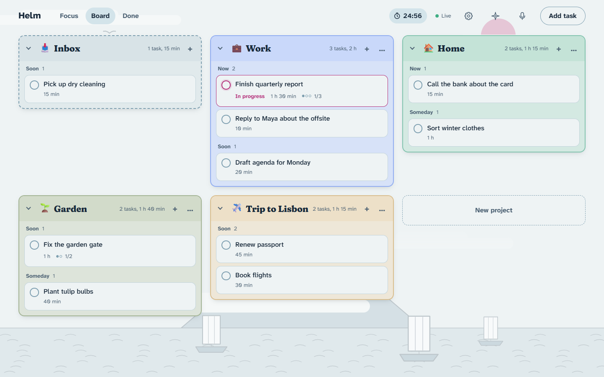
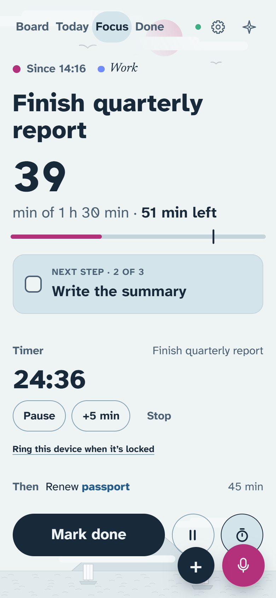
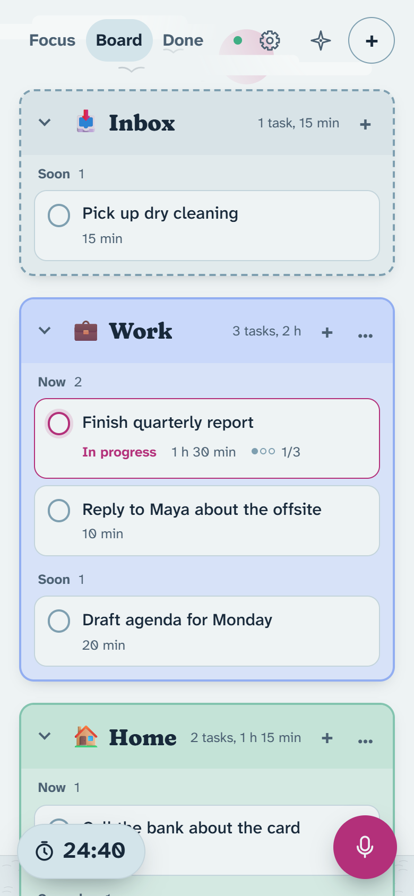
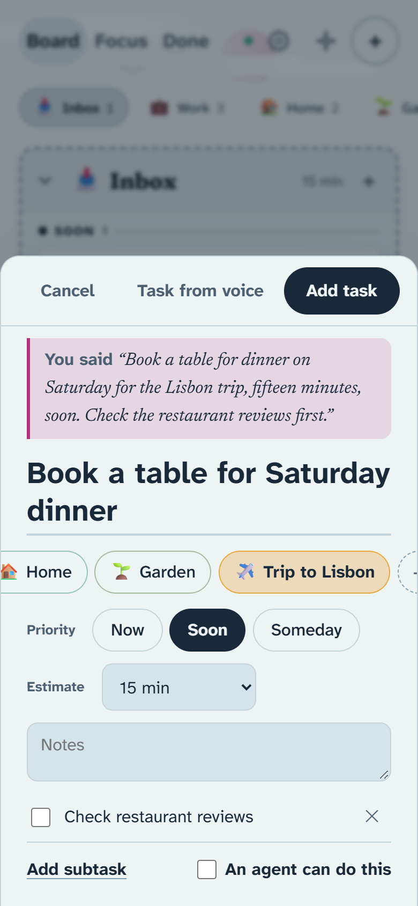

#  Helm

A calm, live task board for you and your AI agents.

Keep it open on a second monitor, install it on your phone, and let AI assistants read and
change it through MCP or a REST API. Changes show up everywhere at once.



<sub>Screenshots show a demo board with sample tasks.</sub>

## Features

- **Board**, the home screen: one panel per project, tasks grouped by **Now**, **Soon** and
  **Someday**. Tabs along the top jump to a project; long panels show 10 tasks, then "Show more".
  Drag tasks between projects and priorities; on a phone, swipe a task right to finish it or left
  to start it. Add a task right in a panel: type, press Enter, type the next.
- **Tasks** with notes, subtasks and an estimate; pick the project with one tap. One task is in
  progress at a time.
- **Focus**: the task you're on, time spent vs. the estimate, and what's next, in one of three
  layouts (One thing, Vital three, Compass).
- **Timer** that runs on the server, so every device shows the same countdown, with a push
  notification when it ends.
- **Done**: what you finished, starting with today, plus an **Activity** feed of every change
  with Undo.
- **Voice**: say what needs doing and Helm drafts the task (title, project, priority, subtasks).
  End with a board and a priority ("..., Home, soon") to file it there.
- **Assistant**: suggests an order for your tasks and answers questions about the board.
- **AI agents**: hand a task to an agent, which claims it, works on it and sends it back for
  your review.
- **Phone app**: installs from the browser and works offline with the last board it saw.
- **Seven themes**, each with a woodblock-print landscape.

<p>
  
  
  
</p>

Desktop keys: **N** new task, **V** voice, **A** assistant, **B** / **F** / **D** to switch views.
Type `:` and a word in any text field for emoji (`:fire` → 🔥).

## Quick start

```bash
pnpm install
cp .env.example .env        # set HELM_OWNER_PASSWORD and HELM_SESSION_SECRET
pnpm dev                    # server on :8787, web on :5173
```

Open http://localhost:5173 and sign in with your password. `pnpm --filter @helm/server seed`
adds sample data.

Set `OPENAI_API_KEY` for voice and the assistant. Without it, voice falls back to the browser's
speech recognition and the assistant is off.

## Run with Docker

```bash
cp .env.example .env        # if you haven't already
docker compose up -d --build
```

Open http://localhost:8787. Data lives in the `helm-data` volume, and a backup of the database
is saved there daily (`/data/backups`, newest 14 kept). To update: `git pull`, then run the same
command again.

To run without Docker: `pnpm build && pnpm start`.

## Phone and other devices

Use [Tailscale](https://tailscale.com) to get an HTTPS address only your devices can open
(needed for installing the app and using the microphone):

1. Install Tailscale on the computer and the phone, same account. Turn on MagicDNS and HTTPS
   certificates in the admin console.
2. On the computer: `tailscale serve --bg 8787`. It prints your address.
3. Set `HELM_COOKIE_SECURE=true` in `.env` and restart Helm.
4. Open the address on your phone and add it to the home screen.

Use `serve`, not `funnel`: funnel puts Helm on the public internet.

A Raspberry Pi 4 or 5 makes a good always-on host: install Docker and Tailscale, clone this repo,
copy your `.env` over, and run the same Docker and Tailscale commands.

## Connect AI agents

In Settings, create a token for each assistant or script: read only or read and change, all
projects or only some. Then connect over MCP:

```bash
claude mcp add --transport http helm http://localhost:8787/mcp --header "Authorization: Bearer helm_..."
```

Or use the REST API at `/api/v1` with the same `Authorization` header.

Agents can list, create, update, start and complete tasks, and claim tasks you've marked
**An agent can do this**. They can't delete anything, only add to notes, and can't complete a
handed-off task: you review it and mark it done. Every change shows in Activity and can be
undone.

## Development

```
apps/server         Hono API, live sync, MCP (all rules live in core/services)
apps/web            React PWA
packages/shared     zod schemas, types, pure logic
packages/db         Drizzle schema + SQLite migrations
packages/providers  LLM and speech-to-text adapters
```

`pnpm test`, `pnpm typecheck`, `pnpm build`. After editing `packages/db/src/schema.ts`, run
`pnpm db:generate`. All settings are in `.env.example`.

## License

[MIT](LICENSE)
